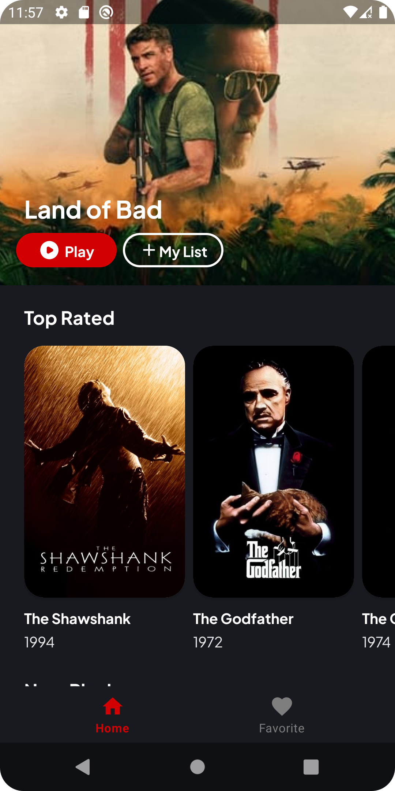
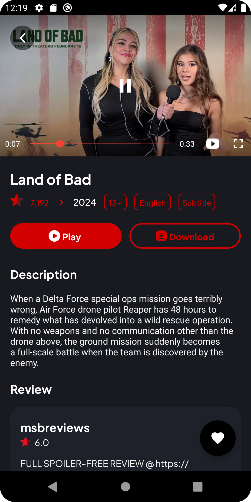

# Okegas Movie App

Okegas Movie App adalah aplikasi Android sederhana yang memungkinkan pengguna untuk menelusuri daftar film populer, menonton trailer film, dan menambahkan film favorit ke daftar pribadi mereka.


## Screenshots and Video Demo

### Screenshot 1


### Video Demo
[](https://www.example.com/video-demo)

### Screenshot 2


## Fitur

- Menampilkan daftar film populer, top rated, dan sedang diputar.
- Menampilkan detail film, termasuk sinopsis, rating, dan trailer jika tersedia.
- Menambahkan dan menghapus film dari daftar favorit.
- Menampilkan daftar film favorit pengguna.
- Menjalankan trailer film menggunakan YouTube Player.
- Pengaturan preferensi untuk mengatur tema aplikasi.

## Library yang Digunakan

- **AndroidX Libraries**
  - Core KTX
  - AppCompat
  - Material Components
  - Constraint Layout
  - RecyclerView
  - CardView
  - Preference

- **Glide**: Library untuk memuat dan menampilkan gambar dengan efisien.
  
- **Mediarouter**: Library untuk menambahkan fitur tampilan layar ke perangkat.

- **Lifecycle**: Library untuk mengelola siklus hidup komponen Android.

- **Navigation**: Library untuk mengelola navigasi antar layar.

- **Retrofit**: Library untuk mengonsumsi layanan web RESTful.

- **Room**: Library untuk membuat dan mengelola basis data lokal.

- **Coroutines**: Library untuk menangani pemrograman asinkron dan tugas berat secara mudah.

- **YouTube Player**: Library untuk memutar video YouTube dalam aplikasi.

## Cara Menjalankan Aplikasi

1. Clone repositori dari GitHub:

```
git clone https://github.com/username/okegas-movie-app.git
```

2. Buka proyek menggunakan Android Studio.

3. Sinkronkan proyek dengan dependensi menggunakan Gradle.

4. Atur pengaturan proyek jika diperlukan, seperti versi Android SDK dan versi Kotlin.

5. Bangun dan jalankan aplikasi pada perangkat fisik atau emulator.

## Kontribusi

Jika Anda ingin berkontribusi pada proyek ini, Anda bisa melakukan fork repositori ini, lakukan perubahan yang diinginkan, dan ajukan pull request.

## Lisensi

Proyek ini dilisensikan di bawah [MIT License](LICENSE).
